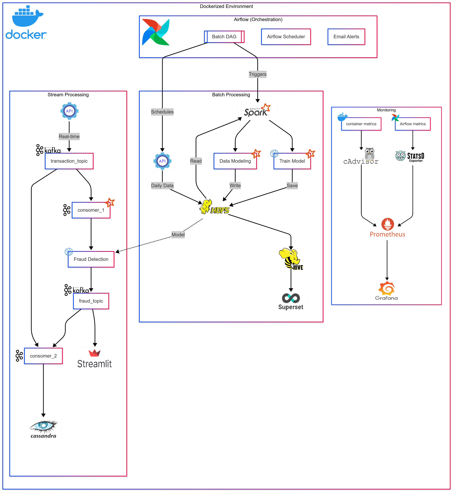

# E-commerce Fraud Detection System

## Overview

This project, developed as part of the YouCode training program, implements a robust fraud detection system for e-commerce transactions. It combines real-time and batch processing pipelines to detect fraudulent transactions instantly and analyze historical data for model improvement. The system is deployed in a Dockerized environment with Apache Airflow orchestration, leveraging tools like Kafka, Spark, HDFS, Hive, Cassandra, Streamlit, Superset, and a monitoring stack (Prometheus, Grafana, cAdvisor, StatsD Exporter).

### Features
- **Real-Time Fraud Detection:** Processes transactions in real-time using Kafka and Spark Streaming.
- **Batch Processing:** Analyzes historical data with Spark and stores results in Hive for reporting via Superset.
- **Persistent Storage:** Uses Cassandra for long-term storage of streaming fraud detection results.
- **Monitoring:** Tracks system performance with Prometheus, Grafana, cAdvisor, and StatsD Exporter.
- **Notifications:** Sends email alerts for Airflow task failures.
- **Visualization:** Provides real-time alerts via Streamlit and analytical reports via Superset.

## Prerequisites

- Docker and Docker Compose
- Python 3.8+
- Apache Spark 3.x
- Apache Kafka
- Apache Airflow
- Access to an SMTP server for Airflow email alerts

## Setup Instructions

### 1. Clone the Repository
```bash
git clone https://github.com/[your-username]/[your-repo-name].git
cd [your-repo-name]
```

### 2. Download the Data
The dataset for this project can be downloaded using the link provided in the `data/source_data.txt` file:
- Navigate to the `data/` directory in the repository.
- Open `source_data.txt` to find the URL link.
- Download the dataset using the link (e.g., via `wget` or a browser):
  ```bash
  wget [URL-from-source_data.txt] -P data/
  ```
- Ensure the downloaded data is placed in the `data/` directory for processing.

### 3. Set Up Environment Variables
Create a `.env` file in the root directory and configure the following:
```bash
AIRFLOW_EMAIL_SMTP_HOST=smtp.example.com
AIRFLOW_EMAIL_SMTP_PORT=587
AIRFLOW_EMAIL_SMTP_USER=your-email@example.com
AIRFLOW_EMAIL_SMTP_PASSWORD=your-password
AIRFLOW_EMAIL_RECIPIENT=recipient@example.com
```

### 4. Build and Run the Docker Containers
- Ensure Docker and Docker Compose are installed.
- Run the following command to start all services (Airflow, Kafka, Spark, Cassandra, Prometheus, Grafana, etc.):
  ```bash
  docker-compose up -d
  ```

### 5. Access the Services
- **Airflow Web UI:** `http://localhost:8080` (default username/password: airflow/airflow)
- **Streamlit (Real-Time Alerts):** `http://localhost:[streamlit-port]` (check `docker-compose.yml`)
- **Superset (Batch Analytics):** `http://localhost:[superset-port]` (check `docker-compose.yml`)
- **Grafana (Monitoring):** `http://localhost:7772` (default username/password: admin/admin)
- **Prometheus:** `http://localhost:7771`

## Project Architecture

The system is divided into three main components within a Dockerized environment:

### 1. Batch Processing
- **Ingestion:** Airflow schedules daily data extraction from APIs.
- **Processing:** Spark processes historical data, performs data modeling, and trains the fraud detection model.
- **Storage:** Data is stored in HDFS, aggregated in Hive, and visualized via Superset.

### 2. Stream Processing
- **Ingestion:** Kafka ingests real-time transaction data via APIs (`transaction_topic`).
- **Processing:** Spark Streaming (Consumer 1) detects fraud, sending results to `fraud_topic`.
- **Storage:** A second consumer (Consumer 2) writes data from both Kafka topics to Cassandra.
- **Visualization:** Streamlit displays real-time fraud alerts from `fraud_topic`.

### 3. Monitoring
- **Tools:** Prometheus collects system metrics, Grafana visualizes performance dashboards, cAdvisor monitors container metrics, and StatsD Exporter provides additional metrics.
- **Purpose:** Ensures system health, tracks latency, throughput, and resource usage.

### Architecture Diagram
  
*Note:* Update the path to the diagram if you’ve included it in the repository.

## Usage

1. **Run Batch Pipeline:**
   - Access the Airflow UI and trigger the `Batch DAG` to process historical data.
   - View analytical reports in Superset.

2. **Run Streaming Pipeline:**
   - Ensure Kafka is running and publishing to `transaction_topic`.
   - Spark Streaming will process data, detect fraud, and send alerts to `fraud_topic`.
   - Streamlit will display real-time fraud alerts.
   - Cassandra will store streaming data for long-term analysis.

3. **Monitor System Performance:**
   - Access Grafana to view dashboards for Kafka throughput, Spark latency, and container metrics.
   - Check Prometheus for raw metrics if needed.

## Security and Compliance
- **Data Encryption:** Sensitive data (IP addresses, card numbers) is encrypted.
- **Access Control:** Role-Based Access Control (RBAC) is implemented across tools.
- **GDPR Compliance:** Personal data is anonymized.
- **Monitoring:** System performance and access are monitored to detect anomalies.

## Contributing
Contributions are welcome! Please fork the repository, create a feature branch, and submit a pull request with your changes.

## License
This project is licensed under the MIT License. See the `LICENSE` file for details.

## Acknowledgments
- YouCode for providing the training framework.
- Open-source communities behind Kafka, Spark, Airflow, and other tools used in this project.
